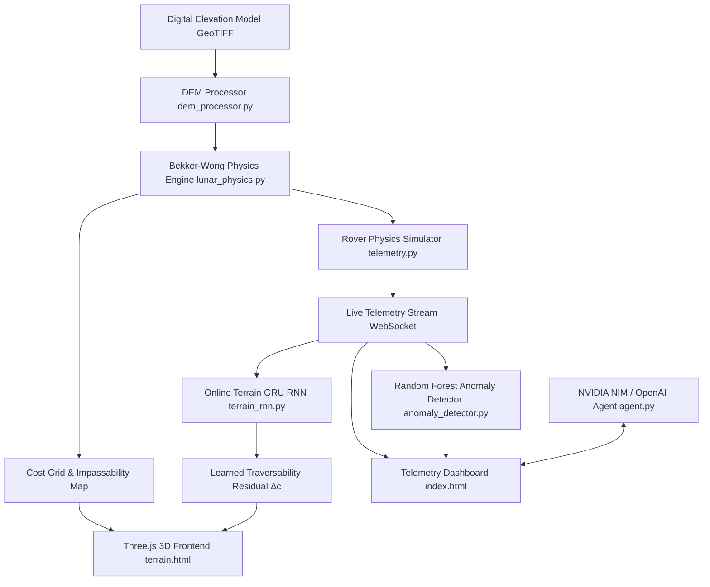

# Mission Copilot: System Architecture, Terramechanics & Machine Learning Specification

## Executive Overview

**Mission Copilot** is a high-fidelity lunar rover simulation, telemetry monitoring, anomaly detection, and AI copilot platform. It bridges terramechanics physics models with real-time machine learning to enable autonomous path safety assessment, hazard detection, and live operator assistance for lunar surface missions.



---

## 1. Bekker-Wong Lunar Terramechanics Model (`lunar_physics.py`)

### 1.1 Physical Fundamentals
Unlike terrestrial rovers, lunar rovers operate under **$1/6\text{th}$ Earth gravity** ($g = 1.62 \text{ m/s}^2$) and navigate fine **lunar regolith** (volcanic impact dust) without any atmospheric air friction. Low gravity reduces normal ground contact force, which significantly degrades wheel traction and causes rovers to sink deeper into loose regolith on slopes.

### 1.2 Regolith Soil Classification Map
Based on Apollo 14-17 field measurements and geotechnical core samples, three distinct lunar soil classes are modeled:

| Soil Class | Cohesion $c$ (kPa) | Friction Angle $\phi$ (deg) | Bulk Density $\rho$ ($\text{g/cm}^3$) | Stiffness $k_c$ ($\text{kN/m}^{n+1}$) | Stiffness $k_\phi$ ($\text{kN/m}^{n+2}$) | Sinkage Exponent $n$ |
| :--- | :--- | :--- | :--- | :--- | :--- | :--- |
| **SOFT** (Crater rims / dust traps) | $0.20$ | $30.0^\circ$ | $1.30$ | $0.90$ | $150.0$ | $0.80$ |
| **MEDIUM** (Typical regolith plains) | $0.50$ | $38.0^\circ$ | $1.50$ | $1.40$ | $280.0$ | $1.00$ |
| **FIRM** (Compacted basin floors) | $1.00$ | $45.0^\circ$ | $1.80$ | $2.50$ | $450.0$ | $1.10$ |

### 1.3 Pressure-Sinkage Formulation (Bekker Equation)
Ground pressure $p$ underneath a rover wheel of width $b$ and diameter $d$ under vertical wheel load $W = \frac{m_{\text{rover}} \cdot g_{\text{moon}}}{4}$ is given by:

$$p = \left( \frac{k_c}{b} + k_\phi \right) z^n$$

Solving for maximum wheel sinkage depth $z_c$:

$$z_c = \left[ \frac{3 W}{(3 - n) \left(k_c + b k_\phi\right) \sqrt{d}} \right]^{\frac{2}{2n + 1}}$$

### 1.4 Shear Traction, Slip Ratio & Slope Limits
The maximum shear stress $\tau_{\text{max}}$ regolith can support before slipping is governed by the Mohr-Coulomb failure criterion:

$$\tau_{\text{max}} = c + \sigma \tan \phi$$

where normal contact stress $\sigma = \frac{W}{A_{\text{contact}}}$.

When climbing a slope of angle $\theta$, the required tractive force ratio yields the **wheel slip ratio $s$**:

$$s = \frac{\tan \theta}{\tan \phi} \cdot \left(1 + \frac{c}{\sigma \tan \phi}\right)^{-1}$$

- **Impassability Thresholds**:
  - Critical Slip: $s \ge 0.85$ (85% wheel spin without forward movement)
  - Critical Sinkage: $z_c \ge 15.0 \text{ cm}$ (chassis bottoming out)
  - Critical Slope: Slope $\theta > \phi - 5^\circ$ for soft soil.

---

## 2. Online Self-Supervised Terrain GRU RNN (`terrain_rnn.py`)

### 2.1 Problem Motivation
Static physics models assume perfect soil parameters. In reality, unmodelled sub-surface rocks, localized dust buildup, and wheel wear cause discrepancies between predicted cost and observed cost. The **Terrain GRU RNN** learns this residual correction $\Delta c$ **online in real time** during navigation.

### 2.2 Neural Network Architecture
The network is implemented in zero-dependency pure NumPy for deterministic low-latency execution:

```
Input Vector x_t [4]  -->  GRU Cell [16 Hidden Units]  -->  Linear Output Layer [1]  --> Residual Δc
```

#### Input Features ($x_t \in \mathbb{R}^4$):
1. $x^{(1)}$: Bekker-Wong predicted physics cost ($0.0 \dots 1.0$)
2. $x^{(2)}$: Observed telemetry cost proxy (motor torque load + slip)
3. $x^{(3)}$: Slope angle in degrees normalized ($\theta / 45^\circ$)
4. $x^{(4)}$: Simulated wheel slip ratio ($0.0 \dots 1.0$)

### 2.3 Gated Recurrent Unit (GRU) Mathematics

For hidden state $h_{t-1} \in \mathbb{R}^{16}$ and input $x_t \in \mathbb{R}^4$:

$$\begin{aligned}
z_t &= \sigma\left(W_z x_t + U_z h_{t-1} + b_z\right) && \text{(Update Gate)} \\
r_t &= \sigma\left(W_r x_t + U_r h_{t-1} + b_r\right) && \text{(Reset Gate)} \\
\tilde{h}_t &= \tanh\left(W_h x_t + U_h (r_t \odot h_{t-1}) + b_h\right) && \text{(Candidate State)} \\
h_t &= (1 - z_t) \odot h_{t-1} + z_t \odot \tilde{h}_t && \text{(Hidden State Update)} \\
\Delta c_t &= W_o h_t + b_o && \text{(Residual Output)}
\end{aligned}$$

where $\sigma(v) = \frac{1}{1 + e^{-v}}$ is the sigmoid activation function.

### 2.4 Real-Time Online Gradient Descent
As the telemetry stream receives new wheel observations, the GRU executes mini-batch Stochastic Gradient Descent (SGD) on the Mean Squared Residual Loss:

$$\mathcal{L} = \frac{1}{2} \left( (\text{physics\_cost} + \Delta c_t) - \text{observed\_cost} \right)^2$$

Weights ($W_z, U_z, W_r, U_r, W_h, U_h, W_o$) update online, allowing the model to adapt within seconds when transitioning between firm regolith and soft crater dust.

---

## 3. DEM & Soil Spatial Processor (`dem_processor.py`)

### 3.1 Digital Elevation Model (DEM) Grid
- Grid Resolution: $128 \times 128$ spatial cells ($16,384$ total nodes).
- Height Generation: Synthetic lunar crater terrain combining macro-crater concavity, ridge rims, and multi-octave Perlin micro-roughness.
- Slope Grid ($\theta_{i,j}$): Calculated using 2nd-order central finite differences across neighbors:

$$\tan \theta_{i,j} = \sqrt{\left(\frac{z_{i+1,j} - z_{i-1,j}}{2 \Delta x}\right)^2 + \left(\frac{z_{i,j+1} - z_{i,j-1}}{2 \Delta y}\right)^2}$$

### 3.2 Soil Property Distribution Grid
Spatial soil distribution is generated using 2D Gaussian filtered spatial fields:
- `SOFT` zones: Concentrated in crater basins and low-elevation shadow pockets.
- `FIRM` zones: Concentrated along exposed bedrock ridge lines.
- `MEDIUM` zones: Standard regolith plains.

---

## 4. Synthetic Telemetry & Anomaly Detector (`telemetry.py`, `anomaly_detector.py`)

### 4.1 Live Telemetry Stream Sensors
Every 1 second, the telemetry generator emits a JSON frame containing:
- `timestamp`: ISO timestamp
- `battery_pct`: Battery state of charge (drains proportional to motor strain)
- `motor_temp_fl`, `motor_temp_fr`, `motor_temp_rl`, `motor_temp_rr`: 4-wheel temperatures ($^\circ\text{C}$)
- `chassis_pitch`, `chassis_roll`: Pitch and roll angles ($^\circ$)
- `wheel_slip_pct`: Live wheel slip percentage ($0\% \dots 100\%$)
- `comms_signal_pct`: Signal quality to orbital satellite link

### 4.2 Anomaly Classification Model
A pre-trained **Random Forest Classifier** (`scikit-learn`) monitors incoming telemetry vectors and flags 4 fault categories:
1. `MOTOR_OVERHEAT`: Individual wheel temp $> 75.0^\circ\text{C}$
2. `BATTERY_DRAIN_CRITICAL`: Sudden voltage drop $> 3\%/\text{min}$
3. `COMMS_DROPOUT`: Signal strength $< 15\%$
4. `TILT_HAZARD`: Chassis tilt $> 30.0^\circ$

---

## 5. 3D WebGL Frontend & Interactive Overlays (`terrain.html`)

The frontend visualizer uses **Three.js** to render interactive 3D terrain with real-time vertex color shaders.

### 5.1 Interactive Overlay Hotkeys
- **`H` Key — Elevation Mode**: Colors vertices based on lunar surface height ($0\text{ m}$ to $25\text{ m}$).
- **`S` Key — Slope Heatmap**: Gradient from green ($0^\circ$ safe) to yellow ($15^\circ$) to red ($30^\circ+$ hazard).
- **`L` Key — Learned Traversability Heatmap**: Blends Bekker-Wong terramechanics physics cost with online GRU RNN corrections $\Delta c$.

### 5.2 Real-Time Telemetry HUD Overlay
Displays dynamic telemetry panels:
- Wheel Slip Gauge (`%`)
- Soil Zone Indicator (`SOFT`, `MEDIUM`, `FIRM`)
- Wheel Sinkage Depth (`cm`)
- RNN Residual Correction ($\Delta c$)
- RNN Accuracy Improvement (`%`)

---

## 6. Execution & Verification Guide

### 6.1 Requirements
- Python 3.10+
- Packages: `fastapi`, `uvicorn`, `websockets`, `pydantic`, `numpy`, `rasterio`, `scikit-learn`, `scipy`, `openai`

### 6.2 Launch Backend Server
```powershell
cd C:\Users\ASUS\Desktop\SIH_2026\backend
uvicorn main:app --reload --port 8000
```

### 6.3 Launch Frontend Server
```powershell
cd C:\Users\ASUS\Desktop\SIH_2026\frontend
npm run dev
```

### 6.4 REST & WebSocket API Reference
- `WS ws://127.0.0.1:8000/ws/telemetry`: Real-time telemetry feed
- `GET http://127.0.0.1:8000/api/terrain/physics`: Soil type, sinkage, slip, and cost grids
- `GET http://127.0.0.1:8000/api/rnn/state`: Live GRU hidden state, total gradient steps, loss, and correction grid
- `POST http://127.0.0.1:8000/api/inject_fault`: Trigger telemetry anomalies (`motor_temp_spike`, `battery_drain`, etc.)
- `POST http://127.0.0.1:8000/api/chat`: AI Mission Copilot assistant query endpoint
